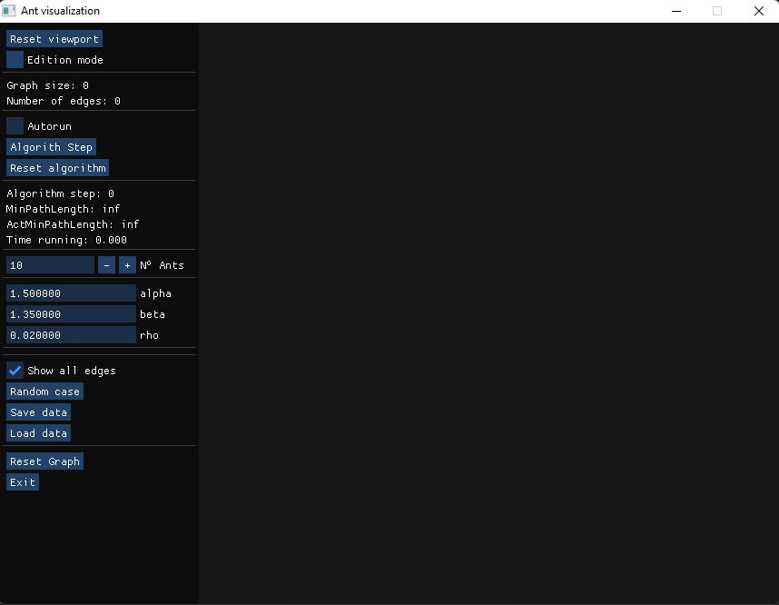
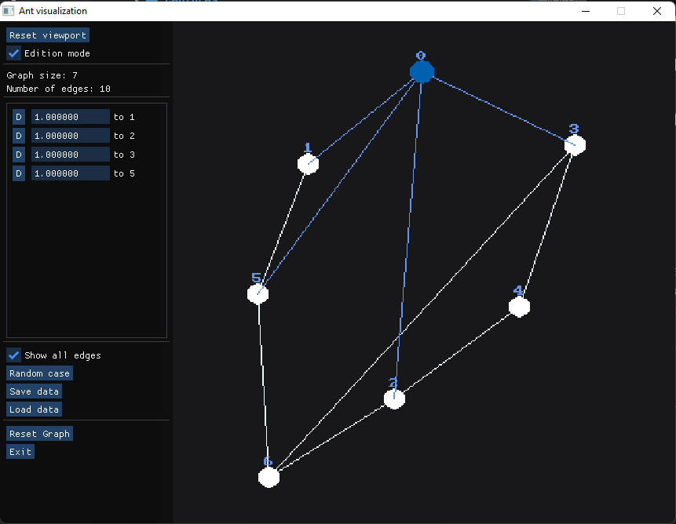
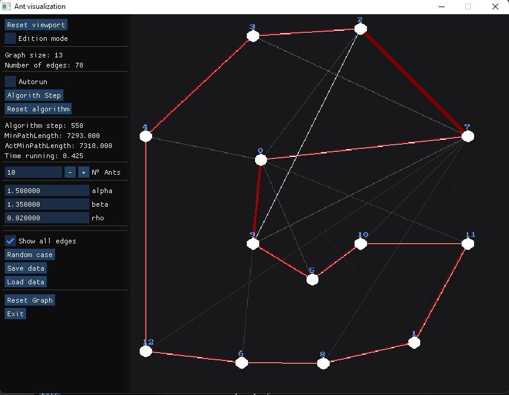

# Ant Colony Optimization

Implementación del algoritmo de optimización por colonia de hormigas.

## Capturas

### Interfaz



### Modo de edición

- Permite:
  - Agregar nodos (click derecho sin nodo seleccionado)
  - Agregar edges
  - Modificar pesos
  - Mover los nodos en la pantalla (presionar `M`)
  


### Ejemplo

Captura del ejemplo incluido en el archivo `test.json`



## Formulas

La cantidad de feromonas dejada por una hormiga en un 'edge' es:
$$\Delta\tau_{i, j}^k = \frac{1}{L_k}$$

donde:

- $\Delta\tau_{i,j}^{k}$ es la cantidad de feromona dejada en el 'edge' $(i,j)$ por la hormiga $k$
- $L_k$ es la longitud total del recorrido que hizo la hormiga $k$

---

La cantidad de feromonas en el 'edge' $(i,j)$ posterior a una iteración del algorimo es:
$$\tau_{i, j} = (1 - \rho) \cdot \tau_{i, j}+\sum_{k = 1}^{m}\Delta\tau_{i, j}^k$$

donde:

- $\rho$ es la constante de desvanecimiento
- $\tau_{i,j}$ es la cantidad de feromonas de la iteración anterior en el edge $(i,j)$
- $m$ es la cantidad total de hormigas
- $\Delta\tau_{i,j}^k$ es la cantidad de feromona dejada en el 'edge' $(i,j)$ por la hormiga $k$ durante la iteración

---

La probabilidad de una hormiga de elegir el 'edge' $(i,j)$ es:
$$P_{i,j} = \frac{(\tau_{i,j})^\alpha \cdot (\eta_{i,j})^\beta}{\sum((\tau_{i,j})^\alpha \cdot (\eta_{i,j})^\beta)}$$

donde:

- $\tau_{i,j}$ es la cantidad de feromonas en el edge $(i,j)$
- $\eta_{i,j} =  \frac{1}{l_{i,j}}$, i.e, el inverso del peso del 'edge' $(i,j)$
- $\alpha$ es una constante utilizada para darle mayor o menor peso a las feromonas
- $\beta$ es una constante utilizada para darle mayor o menor peso a los pesos del grafo

## Dependencias

Se requiere tener instalado:

- SDL2
- SDL2_gfx
- SDL2_image

CMake ya descarga automaticamente:

- fmt
- nlohman json

Para alguna distribución linux (i.e Ubuntu) es sencillo simplemente instalar con

```
sudo apt-get install libsdl2-dev libsdl2-gfx-dev libsdl2-image-dev
```

o el package manager correspondiente a la distro

## Compilación y ejecución

```bash
mkdir build
cmake -S . -B build
cmake --build build
./AntColonyVisualization
```
